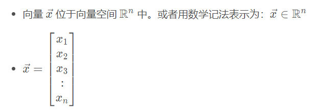
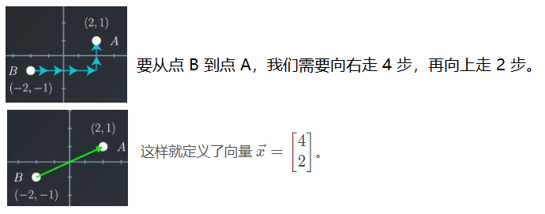
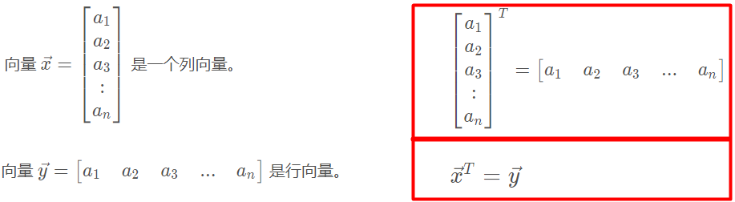
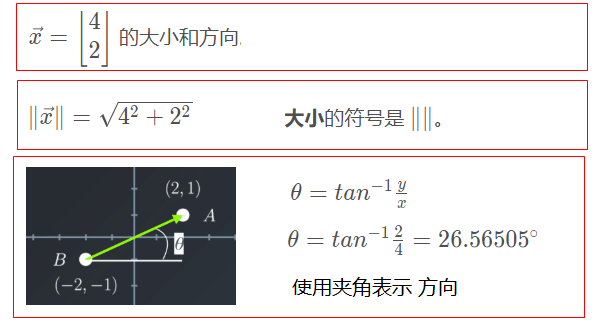
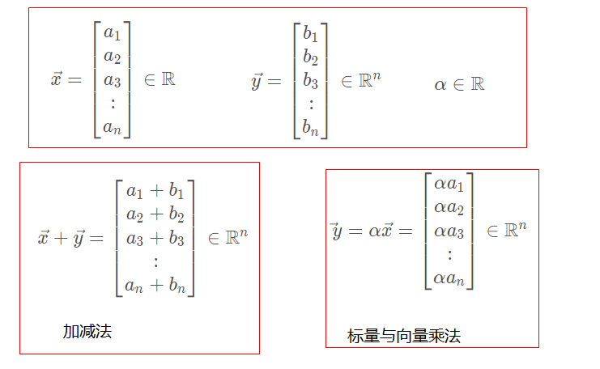
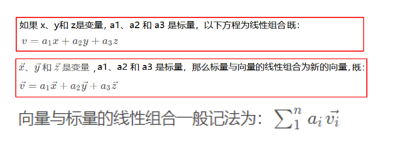
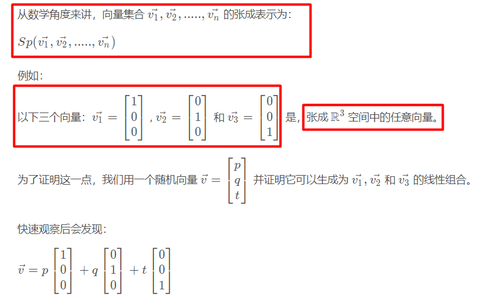
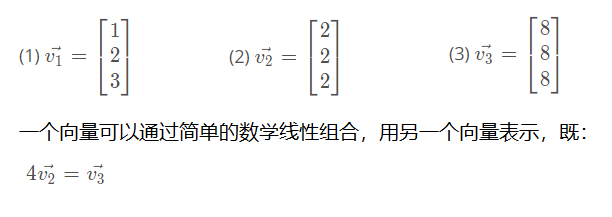

[toc]

## 线性代数和微积分的作用？

> 线性代数为神经网络搭起了框架，使得信息在每一层网络间的传递成为可能；
>
> 微积分令我们可以一步步修改网络参数，使它符合我们想要达成的目标。 

## 向量

### 向量定义

​                          具有 n个真实元素的向量定义了 n 维向量，属于向量空间R*n*。 

### 向量表示

### 转置

### 大小和方向

[向量的大小和方向](http://www.softschools.com/math/pre_calculus/direction_angles_of_vectors/ )

[度数转弧度]( https://www.mathwarehouse.com/trigonometry/radians/convert-degee-to-radians.php )

[三角函数计算器]( https://tool.520101.com/calculator/sanjiaohanshu/ )

### 向量运算

[向量运算公理]( http://mathworld.wolfram.com/FieldAxioms.html )

## 线性组合

### 线性组合与张成

- **线性组合**：一般是指将标量与向量相乘，并将这些项相加。 

- **向量张成：**是指这些向量的所有可能的线性组合。

### 线性相关性

​        例子：

- **线性相关**

  > 当某个向量**可以**定义为其他向量的线性组合时，我们称它们是一组**线性相关**的向量。

- **线性不相关**

  > 当一组向量中的每个向量**都无法**定义为其他向量的线性组合时，它们是一组**线性不相关**的向量。

- **行列式**

  > 判断一组向量是否为线性相关集合的最简单方式是采用**行列式** 

- **案例**

  > 上例中，向量v2,v3是线性相关， 向量v1,v2 与 向量v1,v3为 线性不相关。