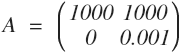

[toc]

### 范数

下面来讲讲范数在机器学习中的应用

- 首先L0表示向量中所有非零元素的个数。正是L0范数的这个属性，使得其非常适合机器学习中稀疏编码，特征选择的应用。通过最小化L0范数，来寻找最少最优的稀疏特征项。
- 再来是L1范数，其应用范围非常的广泛。如在计算机视觉中的[Sum of Absolute Differents](https://en.wikipedia.org/wiki/Sum_of_absolute_differences)，[Mean Absolute Error](https://en.wikipedia.org/wiki/Mean_absolute_error)，还有我们[Lasso回归](https://en.wikipedia.org/wiki/Least_squares#Lasso_method)都是利用L1范式。
- 最后是L2范数，L2范数是最常见，也最著名的范数，我们常见的[Ridge回归](https://ncss-wpengine.netdna-ssl.com/wp-content/themes/ncss/pdf/Procedures/NCSS/Ridge_Regression.pdf)，就是运用L2范数作为惩罚项推导出来的。

- [参考内容](https://www.zhihu.com/question/20473040)

###  理解Ridge Regression与L2范数、条件数之间的联系。 

​	condition number 是一个矩阵（或者它所描述的线性系统）的稳定性或者敏感度的度量，如果一个矩阵的 condition number 很小，那么它就是well-conditioned的，如果非常大，那么它就是 ill-conditioned 的，如果一个系统是 ill-conditioned 的，它的输出结果就不要太相信了。

​	这里再解释下ill-conditioned，这种病态条件的线性系统，或者说这种不够稳定的线性系统我们有个名词，中文叫病态系统，那么线性系统 Ax = b 为什么会病态（不稳定）？
​	归根到底是由于 A 矩阵列向量线性相关性过大，表示的特征太过于相似以至于容易混淆所产生的。举个例子, 现有一个两个十分相似的列向量组成的矩阵 A：

  

在二维空间上，这两个列向量夹角非常小。假设第一次检测得到数据 b = [1000, 0]^T, 这个点正好在第一个列向量所在的直线上，解集是 [1, 0]^T。现在再次检测，由于有轻微的误差，得到的检测数据是 b = [1000, 0.001]， 这个点正好在第二个列向量所在的直线上，解集是 [0, 1]^T。两次求得到了差别迥异的的解集。
（所以照上面的举例来看，是不是可以看出单位矩阵是一个非常稳定的矩阵呢）

### 选做题详解

 对于奇异值,在奇异值矩阵中也是按照从大到小排列，而且奇异值的减少特别的快，在很多情况下，前10%甚至1%的奇异值的和就占了全部的奇异值之和的99%以上的比例。也就是说，我们也可以用最大的k个的奇异值和对应的左右奇异向量来近似描述矩阵。也就是说：
ps:下划线后的数据代表小标，指几乘几矩阵
A_m×n=(U_m×m)(Σ_m×n)(VT_n×n)≈(U_m×k)(Σ_k×k)(VT_k×n)
其中k要比n小很多，也就是一个大的矩阵A可以用三个小的矩阵U_m×k,Σ_k×k,VT_k×n来表示,由于这个重要的性质，SVD可以用于[PCA](https://zh.wikipedia.org/zh-hans/主成分分析)降维，来做数据压缩和去噪。也可以用于推荐算法，将用户和喜好对应的矩阵做特征分解，进而得到隐含的用户需求来做推荐。同时也可以用于[NLP](https://baike.baidu.com/item/NLP/25220)中的算法，比如潜在语义索引（LSI）。 

### 线性代数参考资料

- [脊回归（Ridge Regression）](https://blog.csdn.net/daunxx/article/details/51578787)
- [数值分析：矩阵求逆-奇异性、条件数](https://blog.csdn.net/pipisorry/article/details/52241141)
- [最优化方法：L1和L2正则化regularization](https://blog.csdn.net/pipisorry/article/details/52108040)
- [奇异值分解(SVD)原理与在降维中的应用](https://www.cnblogs.com/pinard/p/6251584.html)

- 现在让我们对线代章节进行总结，其实整个线代的课程，是希望我们通过空间的角度来了解线性代数，课程内容有限，非常推荐毕业后看一下完整的3Blue1Brown视频，能让你对线性代数有更形象的理解：
  https://www.bilibili.com/video/av6731067
- 另外我个人很推荐一本叫 《程序员的数学-线性代数》的书，讲解的也很棒。

